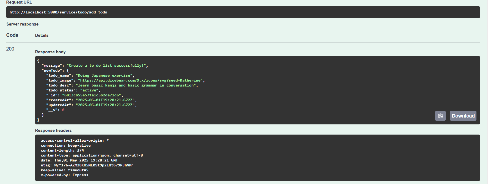
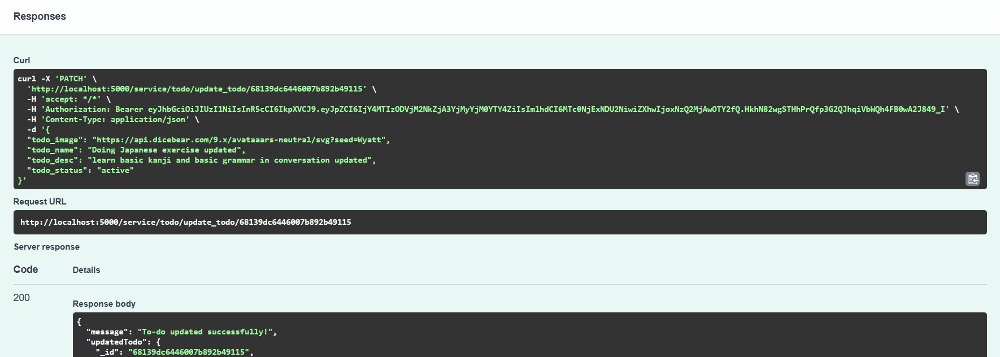
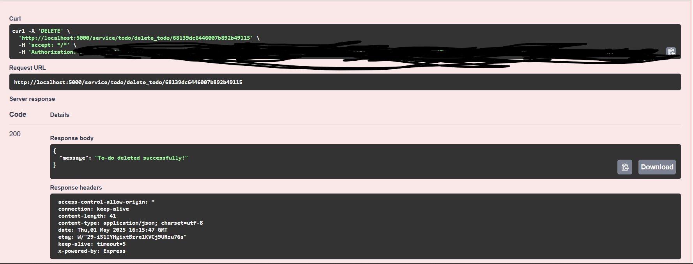
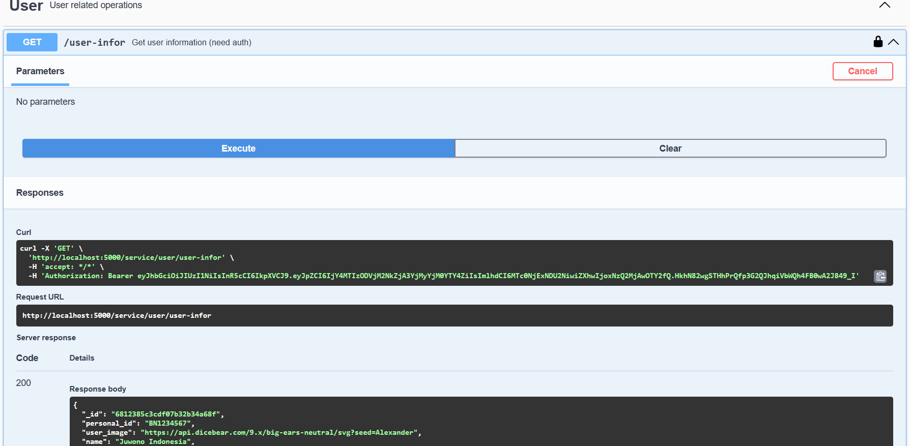

# Proof of API tests

- Create to do

As you can see, status is 200 and message says created sucessfully, which means the api for creating to-do list works.

- Update to do

Status is 200 and message says updated sucessfully, which means the api for updating to-do list works.

- Delete to do

Status is 200 and message says deleted sucessfully, which means the api for deleted to-do list works.

- Sign in (part 1)
.png)
.png)
Status is 200 and message says signed in sucessfully, which means the api for signing in works and it meets the conditions of signing in.

- Sign up (part 1)
.png)
.png)
Status is 200 and message says user registered successfully, which means the api for signing up works and it meets the conditions of signing up.

- user infor

Status is 200 and JSON response shows result, which means the api for user info works, which fetches all the info of users.
